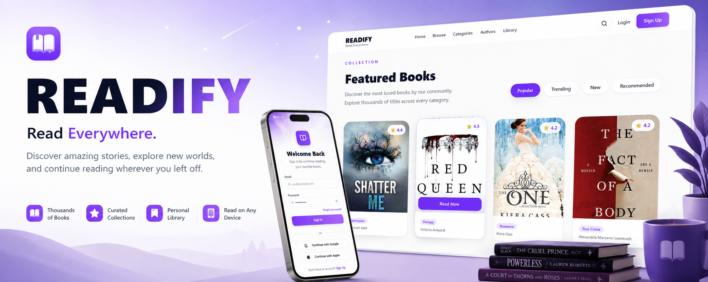
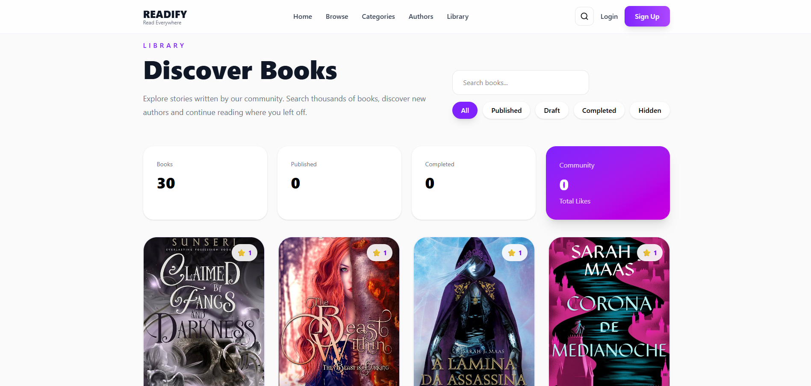
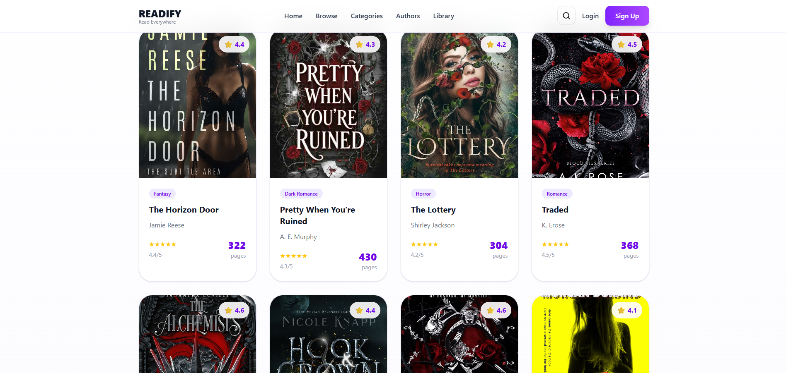
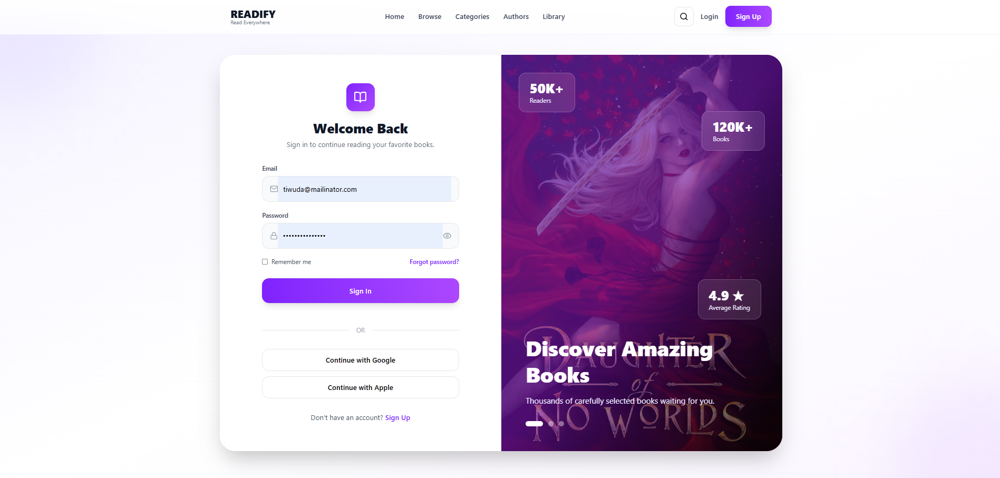
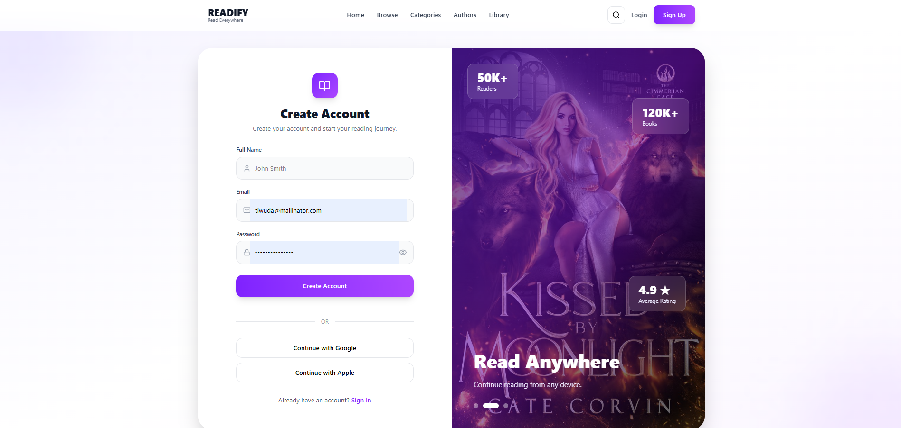
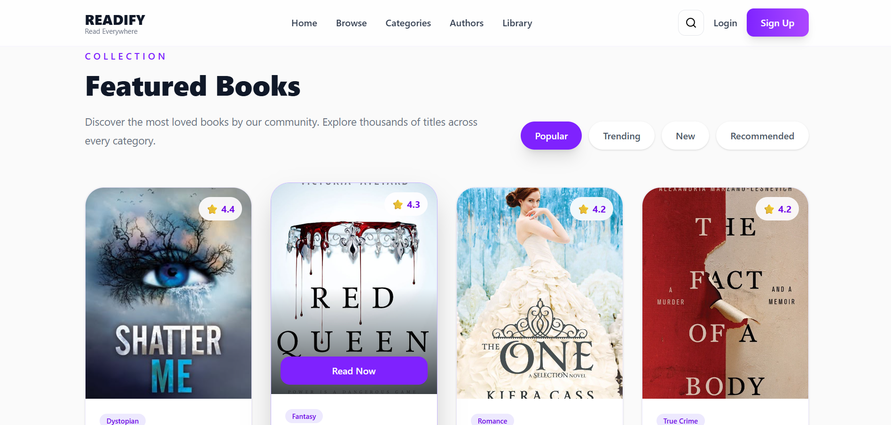
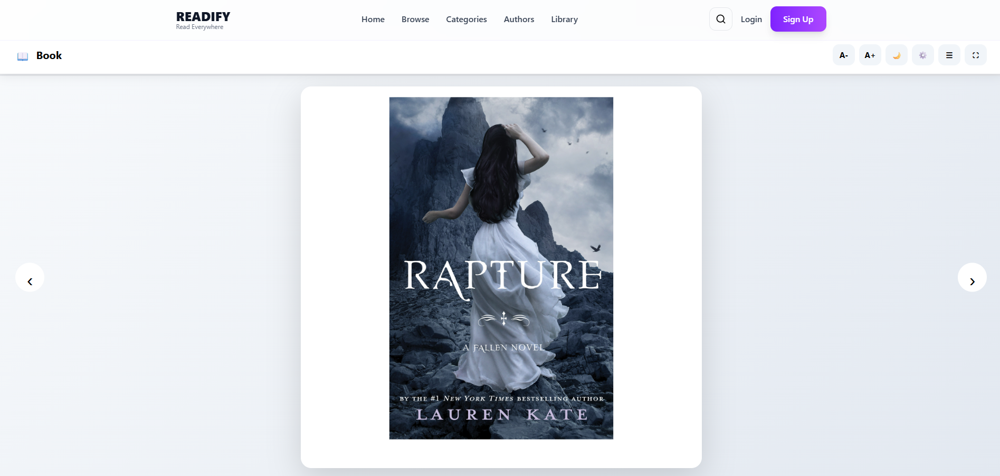
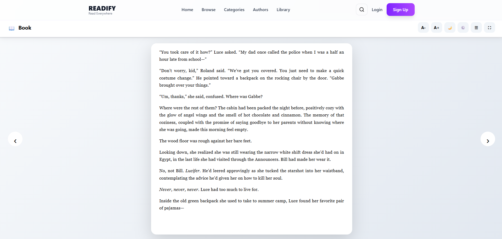

<p align="center">
    
</p>

<div align="center">

# 📚 READIFY

### Read Everywhere.

Modern online reading platform built with **SvelteKit**, designed for discovering, reading and managing thousands of books with a beautiful Kindle-inspired experience.


</div>

---

# ✨ About

READIFY is a modern web platform for reading digital books.

The project combines a clean minimalist interface inspired by Kindle with modern web technologies to provide an enjoyable reading experience.

Users can:

- 📖 Read books directly in the browser
- 🔍 Search through thousands of books
- ⭐ Browse featured collections
- 👤 Discover authors
- 📚 Organize their own library
- ❤️ Save favorite books
- 📱 Enjoy a responsive experience on every device

---

# 🖼 Preview

## 🏠 Home Page



---

## 📚 Browse Books



---

## 🔑 Login



---

## ✍ Register



---

## 📖 Library



---

## 📕 Reading Mode (Cover)



---

## 📄 Reading Mode (Content)



---

# 🚀 Features

## Library

- Browse thousands of books
- Beautiful modern cards
- Featured collections
- Categories
- Ratings
- Search
- Responsive grid

---

## Authentication

- Login
- Registration
- Password visibility toggle
- Google authentication (ready)
- Apple authentication (ready)

---

## Reading Experience

- EPUB support
- Cover preview
- Full reading mode
- Adjustable font size
- Light / Dark mode
- Fullscreen mode
- Responsive layout

---

## User Experience

- Smooth animations
- Modern UI
- Responsive design
- Beautiful typography
- Optimized loading
- Minimalistic interface

---

# 🛠 Tech Stack

## Frontend

- Svelte 5
- SvelteKit
- TypeScript
- Tailwind CSS v4
- Vite

## UI

- Lucide Icons
- Iconify
- CSS Grid
- Flexbox
- Responsive Design

## Reading

- epub.js

## Tooling

- Bun
- ESLint
- Prettier
- Storybook
- Vitest
- Playwright

## Deployment

- Vercel

---

# 📂 Project Structure

```text
src/
│
├── lib/
│   ├── components/
│   ├── assets/
│   ├── stores/
│   ├── types/
│   └── utils/
│
├── routes/
│
├── app.html
│
└── app.css
```

---

# ⚡ Getting Started

## Clone

```bash
git clone https://github.com/USERNAME/readify.git

cd readify
```

## Install

```bash
bun install
```

## Development

```bash
bun run dev
```

Runs the development server at

```
http://localhost:5173
```

---

## Build

```bash
bun run build
```

---

## Preview Production

```bash
bun run preview
```

---

# 📦 Scripts

```bash
bun run dev
```

Start development server

```bash
bun run build
```

Build application

```bash
bun run preview
```

Preview production build

```bash
bun run check
```

Run Svelte type checking

```bash
bun run lint
```

Run ESLint & Prettier

```bash
bun run format
```

Format project

```bash
bun run storybook
```

Run Storybook

```bash
bun run build-storybook
```

Build Storybook

---

# 🎨 Design Philosophy

READIFY follows a clean reading-first philosophy.

The interface focuses on:

- simplicity
- readability
- accessibility
- minimal distractions
- elegant animations
- modern gradients
- soft shadows
- comfortable typography

The overall visual style is inspired by Kindle, Apple Books and modern reading platforms.

---

# 📱 Responsive

- 💻 Desktop
- 💼 Laptop
- 📱 Mobile
- 📟 Tablet

---

# 🌟 Future Plans

- User profiles
- Reading history
- Bookmarks
- Notes & highlights
- Collections
- AI recommendations
- Reading statistics
- Comments
- Reviews
- Offline mode
- Progressive Web App
- Audiobooks
- Notifications

---

# ❤️ Built With

- SvelteKit
- Bun
- Tailwind CSS
- TypeScript

---

<div align="center">

## ⭐ If you like this project, don't forget to leave a star!

Made with ❤️ using **SvelteKit + Bun**

</div>